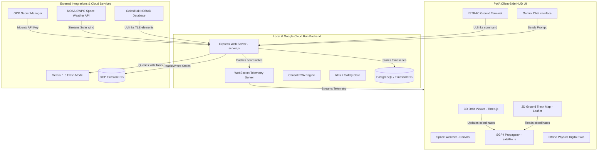

# ISRO NETRA: AI-Powered Space Domain Awareness PWA Dashboard
An enterprise-grade, high-fidelity Space Domain Awareness (SDA) operations room and AI assistant dashboard. NETRA is specifically tailored for monitoring active Indian space assets—supporting the upcoming **Gaganyaan human spaceflight mission** with live Gemini-driven collision avoidance mechanisms and digital twin telemetry.

```text
========================================================================================
    ___ ____  ____   ___       _   _ _____ _____ ____     _      
   |_ _/ ___||  _ \ / _ \     | \ | | ____|_   _|  _ \   / \     
    | |\___ \| |_) | | | |    |  \| |  _|   | | | |_) | / _ \    
    | | ___) |  _ <| |_| |    | |\  | |___  | | |  _ < / ___ \   
   |___|____/|_| \_\\___/     |_| \_|_____| |_| |_| \_/_/   \_\  
                                                                 
  SYSTEM READY // SPACE DOMAIN AWARENESS // COLLISION AVOIDANCE CORE
========================================================================================
```

---

## 🌎 System Overview & Architecture

ISRO NETRA uses a unified client-server architecture with an offline-first fallback. It operates as an installable **Progressive Web Application (PWA)**, utilizing local SGP4 propagation and client-side physics engines for standalone use, while seamlessly locking onto an Express + PostgreSQL backend stack for live telemetry, TimescaleDB history charting, and AI agentic loops.



---

## ⚡ Real-Time Digital Twin Physics Subsystems

Rather than displaying static values or random values, the backend server (and the offline client simulation) integrates multi-physics calculations every second to maintain a living **digital twin** of each space asset:

### 1. Solar Shadow Eclipse Model
Calculates Earth shadow blockage geometrically using geocentric altitude and a sun position vector. If blocked, the satellite enters eclipse, suspending solar panels:
$$\theta_{\text{eclipse}} = \arcsin\left(\frac{R_E}{R_E + alt}\right)$$
$$\text{shadowFactor} = \text{BehindEarth} \times \text{BlockedByCone}$$

### 2. Thermodynamic Heat Balance Model
Battery bay temperatures cool down asymptotically towards deep space temperatures ($3\text{ K}$) when shielded in shadow, and heat up when exposed to solar radiation or when heaters run:
$$Q_{\text{in}} = P_{\text{dissipation}} + Q_{\text{solar\_absorption}} + P_{\text{heaters}}$$
$$Q_{\text{out}} = \sigma \cdot \epsilon \cdot A \cdot \left(T_{\text{batt}}^4 - T_{\text{space}}^4\right)$$
$$\Delta T = \frac{Q_{\text{in}} - Q_{\text{out}}}{m \cdot C_p}$$

### 3. LEO Scale-Height Atmospheric Drag Model
Simulates orbital gas drag altitude decay for orbits under $600\text{ km}$:
$$\rho = \rho_0 \cdot e^{-\frac{alt - alt_0}{H}}$$
$$\Delta alt_{\text{drag}} = - \frac{\rho \cdot v^3 \cdot A \cdot C_d}{2 \cdot m \cdot g}$$
The decay rate scales dynamically by up to 7.5x during high-speed solar storm winds.

### 4. Cosmic Radiation & SEU Model
Models Single Event Upsets (SEU bit flips) as a Poisson process. The probability spikes exponentially based on solar weather proton fluxes and planetary magnetosphere disturbances (Kp index):
$$P_{\text{SEU}} = \lambda_{\text{base}} \cdot \Phi_{\text{proton}} \cdot e^{\frac{Kp}{3.0}}$$
$$\text{seuCount} \leftarrow \text{seuCount} + \text{Poisson}(P_{\text{SEU}})$$

---

## 🛡️ Idris 2 Dependently Typed Flight Safety Core

To prevent command uplinks that violate thermal limits, fuel reserves, or orbital boundaries, all maneuvers must pass verification gates written in **Idris 2** (pre-compiled into JavaScript for client/server execution):

* **Physical Limits**: Bounds check the requested deflection thrust ($0.1\text{ m/s} \le \Delta v \le 15.0\text{ m/s}$).
* **Safety Margin Clearance**: Proves that the post-burn altitude clears the debris collision corridor by at least a safety margin ($\Delta alt \ge 2.0\text{ km}$).
* **ADCS Slew Limits**: Enforces attitude drift/slew rates are within safe margins ($0.05^\circ\text{/s} \le \omega_{\text{slew}} \le 2.0^\circ\text{/s}$).
* **Power Grid Guard**: Prevents burn ignition commands if battery State-of-Charge is critically low ($\text{SoC} < 15.0\%$).
* **Fuel Depletion**: Deducts propellant mass dynamically ($12\text{ kg}$ per $1\text{ m/s}$ delta-V) and rejects burns exceeding available reserves.

---

## 🧠 Root Cause Analysis & Semantic Knowledge Graph

The dashboard incorporates a **Semantic Knowledge Graph** linking space weather anomalies to spacecraft telemetry:

```text
  [Solar Proton wind] ────► [Ionospheric Scintillation] ────► [Downlink SNR Degrades]
          │
          ├───────────────► [Thermal Bay ESD Currents] ───► [Battery Temp Spikes]
          │
          └───────────────► [Thermosphere Expansion] ─────► [Atmospheric Drag Decay]
```

When an anomaly triggers, the **RCA Engine** traverses the directed dependency graph backwards (Depth First Search causal back-propagation) to isolate and report the root weather sensors or physical triggers, enabling operators to diagnose structural degradation instantly.

---

## 🐙 Octopus Integration Gateway
The dashboard acts as a highly-connected space operations hub via the **Octopus Gateway**:

1. **Outbound Webhook Channels (Tentacles Out)**: Register HTTP webhooks to receive real-time JSON payloads on key event transitions:
   * `CONJUNCTION_WARNING` / `CONJUNCTION_CLEARED`
   * `SOLAR_STORM_ALERT` / `SOLAR_STORM_CLEARED`
   * `ANOMALY_TRIGGERED` / `ANOMALY_CLEARED`
   * `MANEUVER_EXECUTED`
2. **Web MCP Server (SSE Transport)**: Exposes the Model Context Protocol (MCP) server over HTTP Server-Sent Events (SSE) at `/api/mcp/sse`, enabling cloud-based AI systems to directly connect and query space assets.
3. **Stdio MCP Server**: Run `mcp-server.js` directly via stdio to integrate spacecraft tools into local AI tools like Claude Desktop or Cursor.

---

## 📁 Repository Directory Structure

```text
├── index.html            # PWA Cyber HUD Shell (Minimal outlines, viewports)
├── server.js             # Node Express Server (Proxy, WS streams, SSE MCP gateway)
├── db.js                 # Database engine (PostgreSQL, TimescaleDB, local fallback)
├── manifest.json         # PWA Web App manifest specifications
├── sw.js                 # service worker cache-first asset storage script
├── mcp-server.js         # Stdio-based MCP server protocol implementation
├── package.json          # Dependency mappings
├── Dockerfile            # Container config for Google Cloud Run
├── cloudbuild.yaml       # GCP Cloud Build CI/CD script
├── DEPLOY_GCP.md         # Full GCP setup guide
├── RUNNING_PROCEDURE.md  # Step-by-step local launch run book
├── styles/
│   ├── main.css          # Color variables, layout system, scanner overlay
│   └── hud.css           # Figma-grade layouts, fluid stacked media queries
├── src/
│   ├── main.js           # App initialization, service worker register, navbar router
│   ├── core/
│   │   ├── state.js      # Pub/Sub central store & local clock loop
│   │   ├── audio.js      # Web Audio cyberpunk sound effects synthesizer
│   │   ├── propagator.js # SGP4 Keplerian orbital trajectory calculator
│   │   ├── avoidance-proof.js # Idris 2 compiled orbit bounds validation gate
│   │   └── subsystem-safety-proof.js # Idris 2 subsystem state validation gate
│   ├── data/
│   │   └── Tle-db.js     # Seeding catalog for ISRO & international satellites
│   └── components/
│       ├── orbit-viewer.js      # 3D Earth wireframe and orbit plotter (Three.js)
│       ├── ground-track.js      # 2D Mercator flat map and footprints (Leaflet)
│       ├── space-weather.js     # Solar wind physics charts (Canvas)
│       ├── telemetry-terminal.js# Ground control command parser (/burn, /storm, /rca)
│       ├── telemetry-charts.js  # Timeseries health charts (Canvas)
│       ├── root-cause-analyzer.js # Dynamic causal RCA diagnostics tree
│       ├── collision-monitor.js # Proximity scanning, threat warning cards
│       ├── agent-console.js     # Gemini agent console, client-side tool router
│       └── integration-manager.js# Webhooks controller, gateway health tracker
└── scratch/              # Automated Python validation test suites
    ├── verify_physics.py # Validates digital twin physics models integration
    ├── verify_idris.py   # Validates Idris 2 flight boundary constraints
    ├── verify_subsystems.py # Validates Idris 2 subsystem safety limits
    ├── verify_rca.py     # Validates causal knowledge graph diagnostics
    ├── verify_webhooks.py# Validates outbound webhooks payloads
    ├── verify_mcp_sse.py # Validates Server-Sent Events JSON-RPC tool-calling
    └── verify_database.py# Validates PostgreSQL database transactions
```

---

## 🛠️ Operational Getting Started Guide

### 1. Standalone UI Mode (Immediate Execution)
Run the application in standalone mode instantly without dependencies:
1. Double-click `index.html` to open it in your browser.
2. The SGP4 orbital propagator and digital twin physics will run client-side.
3. Open Developer Tools, toggle Device Toolbar (emulate iPhone/Pixel) to verify fluid mobile responsiveness (stacked grid, ribbon navigation bar, slide-out index drawer).
4. Paste a Gemini API Key in the chat console key field to execute live tool-calling loops directly in the browser (saved securely in `localStorage`).

### 2. Local Container Stack Mode
To launch the full backend server and PostgreSQL database:
1. Ensure your host machine has Docker Desktop started.
2. Build and launch the container group:
   ```bash
   docker compose up --build
   ```
3. Open `http://localhost:8080` in your web browser.
4. Run automated test checks in another terminal:
   ```bash
   python scratch/verify_physics.py
   python scratch/verify_idris.py
   python scratch/verify_webhooks.py
   ```

### 3. Model Context Protocol Configuration
To mount the Space Intelligence Dashboard tools directly into your AI workspace:

#### Claude Desktop
Add this to `%APPDATA%\Claude\claude_desktop_config.json`:
```json
{
  "mcpServers": {
    "isro-netra-mcp": {
      "command": "node",
      "args": [
        "D:/space-intelligence-dashboard/mcp-server.js"
      ]
    }
  }
}
```

#### Cursor IDE
1. Open Cursor and go to **Settings** -> **Features** -> **MCP**.
2. Click **+ Add New MCP Server**.
3. Name: `isro-netra-mcp`, Type: `stdio`.
4. Command: `node D:/space-intelligence-dashboard/mcp-server.js`.

---

## 🤖 Gemini AI Agent Tool Catalog

When queried with queries like *"Check Gaganyaan health and steer the satellite to safety if weather allows"*, Gemini utilizes these custom functional tools:

| Tool Name | Parameters | Return Schema | Description |
| :--- | :--- | :--- | :--- |
| `get_space_assets` | None | `{ satellites: Array }` | Exposes tracked satellites, TLE strings, and orbit positions. |
| `get_space_weather` | None | `{ spaceWeather: Object }` | Exposes Kp-index, proton flux, wind speed, and magnetic field. |
| `get_anomaly_diagnostics` | None | `{ diagnostics: Array }` | Exposes temperatures, State-of-Charge, and failure countdowns. |
| `get_root_cause_analysis` | `satelliteId` | `{ activeAnomalies, chains }` | Returns DFS causality paths back to active environmental triggers. |
| `consult_solar_physics_analyst` | `satelliteId` | `{ status: CLEAR/ABORT, reasoning }` | Checks Aditya-L1 sensors for solar storm safety. |
| `validate_subsystem_state` | `satelliteId` | `{ status: PASS/FAIL, proof }` | Checks power grid, thruster fuel, and ADCS limit types. |
| `calculate_avoidance_vector` | `satelliteId` | `{ recommendedDeltaV, direction }` | Computes evasion burn thrust requirements. |
| `execute_orbital_burn` | `satelliteId, deltaV, direction` | `{ status: SUCCESS/FAIL }` | Fires satellite thrusters (validated by Idris 2). |
