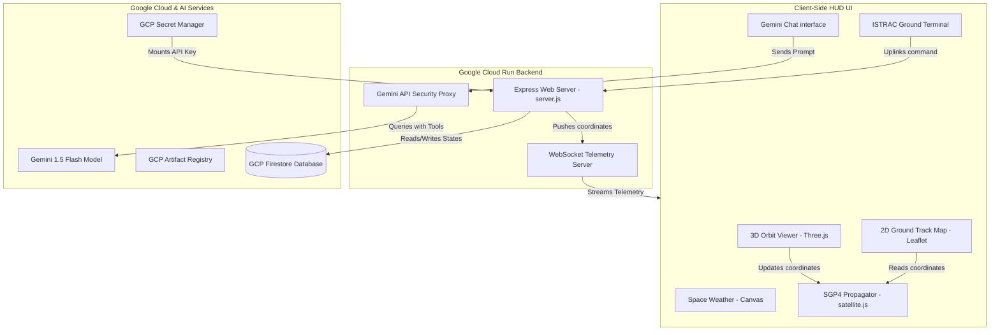

# ISRO NETRA: AI-Powered Real-Time Space Intelligence Dashboard

An enterprise-grade, modular Space Domain Awareness (SDA) operations room and AI assistant dashboard, designed to track key Indian space assets (such as the **Gaganyaan crew module** and **NavIC navigation constellation**) and automate collision shielding maneuvers using SGP4 orbital mechanics and **Gemini Function Calling**.

```
    __  ___ ___  ____   ____     _  __ ___ ______ ____   ___ 
   /  |/  //   |/ __ \ / __ \   / |/ //  //_  __// __ \ /   |
  / /|_/ // /| // /_/ // /_/ /  /  / // /   / /  / /_/ // /| |
 / /  / // ___// ____// ____/  / /  // /   / /  / _, _// ___ |
/_/  /_//_/  _//_/    /_/     /_/|_//_/   /_/  /_/ |_|/_/  |_|
                                                             
```

---

## Key Features

1. **SGP4 Orbital Propagator (Real Physics)**: Uses standard Keplerian perturbation algorithms via `satellite.js` to track active space objects, including the **Gaganyaan-1 module**, **Cartosat-3**, and **NavIC navigation constellation (IRNSS-1I & 1G)**.
2. **3D Interactive Space Globe**: Built with **Three.js** to render a cyberpunk-styled Earth wireframe, orbital trails, and real-time interactive satellite selectors.
3. **Space Weather Solar Monitors**: Displays simulated real-time telemetry from **Aditya-L1's solar payloads** (ASPEX, PAPA, MAG) on a high-performance HTML5 Canvas chart.
4. **Gemini AI Operations Agent (Function Calling)**: Houses a client-server AI agent loop that interacts with the `@google/generative-ai` SDK. Gemini uses tools (`get_satellite_states`, `calculate_avoidance_vector`, `execute_orbital_burn`) to evaluate collision warnings and fire satellite thrusters autonomously.
5. **Persistent Database Layer (GCP Firestore)**: Integrates with **Google Cloud Firestore** to store TLE records, operations log histories, and agent action audit traces. Features an **offline JSON-file database fallback (`db-local.json`)** for local testing.
6. **Synth Interface Audio**: Employs the browser's native **Web Audio API** to generate sound effects (clicks, alert sirens, cabin hums) dynamically without media asset delays.

---

## System Architecture



---

## Directory Layout

```
├── index.html            # Main Cyber HUD Shell (ISRO NETRA design)
├── server.js             # Node Express Server (Vertex AI/Gemini proxy & WS Server)
├── db.js                 # Database wrapper (GCP Firestore / Local DB)
├── package.json          # Dependency mappings
├── Dockerfile            # Container configuration for Google Cloud Run
├── cloudbuild.yaml       # Google Cloud Build CI/CD pipeline script
├── DEPLOY_GCP.md         # Full step-by-step GCP configuration instructions
├── styles/
│   ├── main.css          # Core CSS variables, typography, and scanning animations
│   └── hud.css           # Glassmorphic panels and layout grids
└── src/
    ├── main.js           # App Entrypoint & Event-bus router
    ├── core/
    │   ├── state.js      # Reactive Pub/Sub state store & clock ticks
    │   ├── audio.js      # Web Audio sound effects synthesizer
    │   └── propagator.js # satellite.js SGP4 propagation wrapper
    ├── data/
    │   ├── tle-db.js     # NORAD TLE parameters catalog
    │   └── weather-db.js # Aditya-L1 solar sensor schemas
    └── components/
        ├── orbit-viewer.js      # 3D canvas renderer (Three.js)
        ├── space-weather.js     # Solar wind chart manager
        ├── collision-monitor.js # Proximity analyzer & threat triggers
        ├── telemetry-terminal.js# Ground Control CLI shell (ISTRAC commands)
        └── agent-console.js     # Gemini agent execution logger
```

---

## Phased Getting Started Roadmap

We are developing this system in four distinct validation phases to maintain architectural focus:

### Phase 1: Standalone Client UI (Immediate & Zero-Setup)
Verify the visual HUD animations, 3D Canvas rendering, and SGP4 mechanics locally in your browser.
1. Double-click [index.html](file:///D:/space-intelligence-dashboard/index.html) to open it.
2. Verify you can drag/rotate the globe, check active orbits, and view solar wind charts.
3. Test Ground Control commands: type `/diagnose` or `/burn gaganyaan 1.45` in the terminal input.
4. Paste a Gemini API Key in the chat panel configuration input and test live prompts (e.g. *"Check for debris risks"*).

### Phase 2: Local Server & JSON Database Persistence
Run the backend Express and WebSocket servers locally.
1. Install Node.js dependencies:
   ```bash
   npm install
   ```
2. Start the local server:
   ```bash
   npm run dev
   ```
3. Open `http://localhost:8080` in your web browser.
4. Verify that `db-local.json` is generated on disk and records your terminal commands.

### Phase 3: Google Cloud Run & Firestore Deployment
Migrate the prototype to a secure serverless cloud environment.
1. Initialize a native **Google Cloud Firestore** database in the `asia-south1` region.
2. Upload your Gemini API Key to **GCP Secret Manager** as `GEMINI_API_KEY`.
3. Submit the build container:
   ```bash
   gcloud builds submit --config=cloudbuild.yaml --substitutions=PROJECT_ID=YOUR_PROJECT_ID
   ```
4. Read the detailed [DEPLOY_GCP.md](file:///D:/space-intelligence-dashboard/DEPLOY_GCP.md) for IAM permissions mappings.

### Phase 4: Autonomous Multi-Agent Systems
Write external python script listeners to interact with the WebSocket server gateway.
- Outgoing: The server streams space asset coordinate arrays every 1s at `ws://<your-host>/ws/agent`.
- Incoming: Programmatic agents can issue a maneuver override to fire thrusters using:
  ```json
  { "action": "MANEUVER_ORBIT", "satelliteId": "gaganyaan", "deltaV": 1.45, "direction": "PROGRADE" }
  ```

---

## Model Context Protocol (MCP) Server Integration

The Space Intelligence Dashboard includes a built-in stdio-based **Model Context Protocol (MCP)** server. This allows external LLMs and AI clients (like Claude Desktop, Cursor, or peer agents) to directly interact with our spacecraft digital twins, run causality-based diagnostics, and execute safety-checked orbital evasion maneuvers.

### Exposed Tools

1. `get_space_assets`: Exposes tracked spacecraft and debris with coordinates, threat levels, and digital twin subsystem states.
2. `get_space_weather`: Exposes solar wind, proton flux, and Kp index.
3. `get_anomaly_diagnostics`: Exposes active anomalies and time-to-failure countdowns.
4. `get_root_cause_analysis`: Traverses directed causality trees to diagnose subsystem failures.
5. `consult_solar_physics_analyst`: Evaluates space weather parameters for safety clearance.
6. `validate_subsystem_state`: Runs type-level safety validations of battery SoC, fuel level, and ADCS.
7. `calculate_avoidance_vector`: Computes evasion burn magnitudes and directions.
8. `execute_orbital_burn`: Performs thrust maneuvers (validating bounds via Idris 2 type-safety).

### Configuring Claude Desktop

Add the following configuration to your Claude Desktop config file (located at `%APPDATA%\Claude\claude_desktop_config.json` on Windows):

```json
{
  "mcpServers": {
    "isro-netra-mcp": {
      "command": "node",
      "args": [
        "D:/space-intelligence-dashboard/mcp-server.js"
      ]
    }
  }
}
```

### Configuring Cursor IDE

1. Go to **Settings** -> **Features** -> **MCP**.
2. Click **+ Add New MCP Server**.
3. Name: `isro-netra-mcp`
4. Type: `stdio`
5. Command: `node D:/space-intelligence-dashboard/mcp-server.js`

